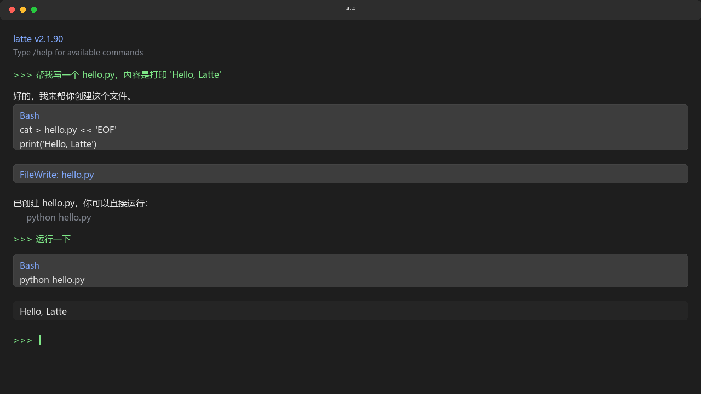

# Latte



Latte 是 Claude Code 的一个可构建分支，去除了遥测功能并解锁了实验特性。支持中文界面和多模型接入。

## 特点

- **中文支持** - 命令和界面均支持中文显示
- **多模型** - 支持 Anthropic、DeepSeek、Kimi、GLM、Qwen 等
- **实验功能** - 可解锁 54+ 个实验性功能标志
- **单文件** - 构建后单个可执行文件，无需安装依赖

## 快速开始

### npm 全局安装（推荐）

```bash
npm install -g latte
```

安装完成后直接运行 `latte`。

### Windows

```powershell
irm https://github.com/wxj-1019/latte-code/releases/latest/download/latte.exe -OutFile latte.exe
.\latte.exe
```

### macOS / Linux

```bash
curl -fsSL https://raw.githubusercontent.com/wxj-1019/latte-code/main/install.sh | bash
```

安装完成后运行 `latte` 并使用 `/login` 登录。

## 配置模型

### 交互式配置（推荐）

启动 Latte 后在认证界面选择「自定义 API 接入」，按提示输入 Base URL、API Key 和模型名称。

### 环境变量

| 变量 | 说明 | 示例 |
|------|------|------|
| `LATTE_API_KEY` | API Key | `sk-your-key` |
| `LATTE_BASE_URL` | API 地址（不带路径后缀） | `https://api.deepseek.com` |
| `LATTE_MODEL` | 模型名称 | `deepseek-chat` |
| `CLAUDE_CODE_COMPATIBLE_API_PROVIDER` | 协议类型 | `openai` |

`ANTHROPIC_*` 和 `DOGE_*` 前缀的变量同样支持。

### 配置示例

**DeepSeek:**
```powershell
$env:LATTE_API_KEY = "sk-your-key"
$env:LATTE_BASE_URL = "https://api.deepseek.com"
$env:LATTE_MODEL = "deepseek-chat"
$env:CLAUDE_CODE_COMPATIBLE_API_PROVIDER = "openai"
```

**Kimi:**
```powershell
$env:LATTE_API_KEY = "sk-your-key"
$env:LATTE_BASE_URL = "https://api.moonshot.cn/v1"
$env:LATTE_MODEL = "moonshot-v1-8k"
$env:CLAUDE_CODE_COMPATIBLE_API_PROVIDER = "openai"
```

**Ollama 本地:**
```powershell
$env:LATTE_API_KEY = "ollama"
$env:LATTE_BASE_URL = "http://localhost:11434/v1"
$env:LATTE_MODEL = "qwen2.5-coder:7b"
$env:CLAUDE_CODE_COMPATIBLE_API_PROVIDER = "openai"
```

更多配置见 [`docs/custom-model-guide.md`](docs/custom-model-guide.md)。

## 构建

需要 [Bun](https://bun.sh) >= 1.3.11。

```bash
git clone https://github.com/wxj-1019/latte-code.git
cd latte-code
bun install

# 开发构建
bun run build:dev

# 生产构建
bun run build

# 完整实验功能
bun run build:dev:full
```

构建输出:
- `bun run build` -> `./latte`
- `bun run build:dev` -> `./latte-dev`

## 全局安装

构建后安装到系统 PATH:

```bash
bun run install:global
```

之后可直接使用 `latte` 命令。

## 使用

```bash
# 交互模式
latte

# 单次查询
latte -p "列出当前目录的文件"

# 指定模型
latte --model claude-opus-4-6

# 登录
latte /login

# 帮助
latte /help
```

常用命令:
- `/help` - 显示帮助
- `/login` - 登录
- `/config` - 配置面板
- `/cost` - 查看费用
- `/compact` - 压缩对话
- `/clear` - 清除历史
- `/exit` - 退出

## 内置 Skills

Latte 集成了多个自动触发的技能:

- **superpowers** - 完整的软件开发工作流框架（自动触发）
- **design-md** - 66+ 品牌设计系统，设计审查与代码生成（自动触发）

查看所有技能: `/skills`

## 实验性功能

使用 `bun run build:dev:full` 解锁全部 54 个实验性功能，包括:

- `VOICE_MODE` - 语音输入
- `ULTRAPLAN` - 超级计划模式
- `KAIROS` - 高级 AI 功能
- `BRIDGE_MODE` - 远程控制

## 技术栈

- Runtime: [Bun](https://bun.sh)
- Language: TypeScript
- UI: [Ink](https://github.com/vadimdemedes/ink) (React for CLI)

## License

MIT - 详见 [LICENSE](LICENSE)
